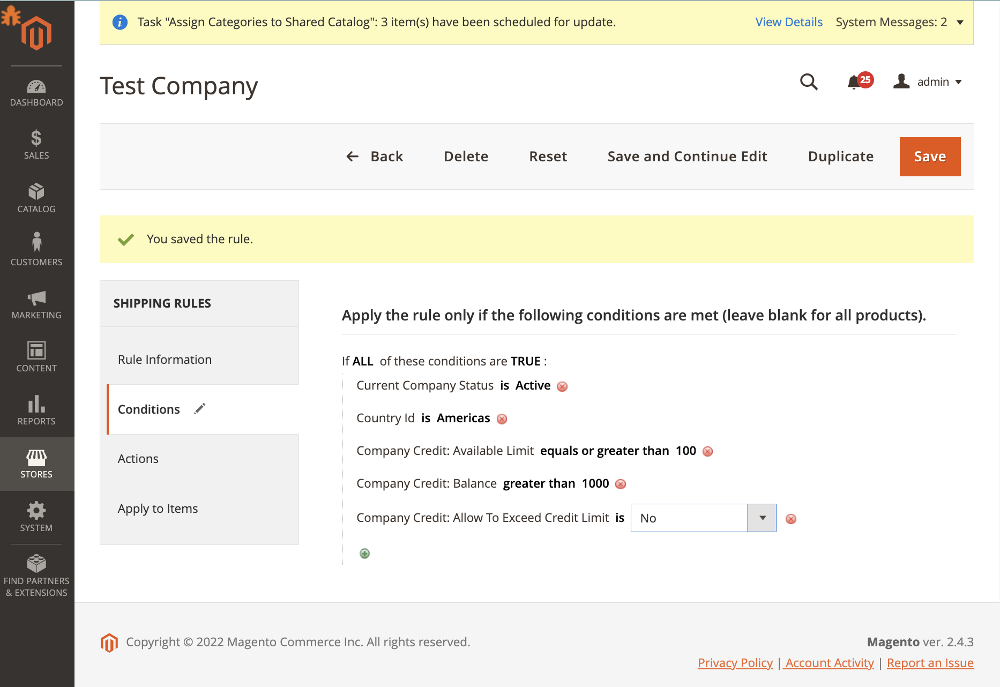

# MageWorx Shipping Rules Company Credit Conditions (B2B) Extension for Magento 2

## Upload the extension

### Upload via Composer

1. Log into Magento server (or switch to) as a user who has permissions to write to the Magento file system.
2. Create a folder anywhere on your server (preferably not in the Magento install dir). When done, upload all extension zip packages in there.
3. To use the folder created above as a packaging repository, add the run composer command:
```
    composer config repositories.mageworx artifact {YOUR/ABSOLUTE/PATH/TO/EXTENSIONS/DIRECTORY}
```
For example:
```
    composer config repositories.mageworx artifact /Users/mageworxuser/magento_extensions/mageworx/zip
```

This command add to your composer.json file this lines:

```
    "mageworx": {
        "type": "artifact",
        "url": "/Users/mageworxuser/magento_extensions/mageworx/zip"
    }
```

4. Install the extension with Composer:
```
composer require mageworx/module-shippingrules-company-credit
```

### Upload by copying code

1. Log into Magento server (or switch to) as a user who has permissions to write to the Magento file system.
2. Download the "Ready to paste" package from your customer's area, unzip it and upload the 'app' folder to your Magento install dir.


## Enable the extension

1. Log in to the Magento server as, or switch to, a user who has permissions to write to the Magento file system.
2. Go to your Magento install dir:
```
cd <your Magento install dir> 
```

3. And finally, update the database and autogenerated files:
```
php bin/magento setup:upgrade
php bin/magento setup:di:compile
php bin/magento setup:static-content:deploy
```

## Features

### Adds new conditions for the Shipping Suite rules

- Company Credit: Available Limit
- Company Credit: Balance
- Company Credit: Allow To Exceed Credit Limit



> Important note: This feature is available only if you have Magento B2B modules installed on your system.
